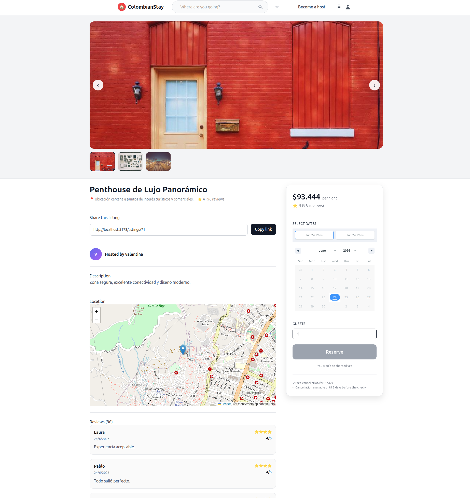
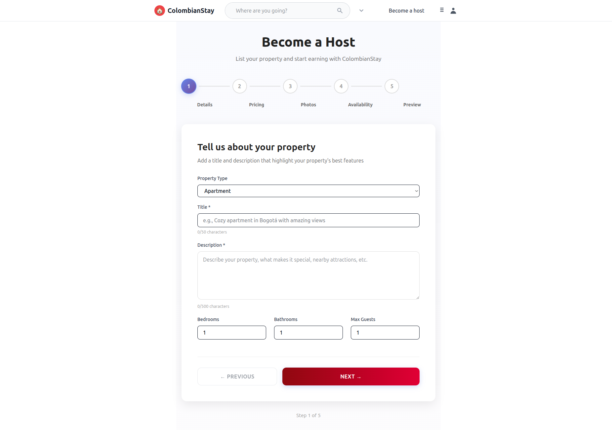
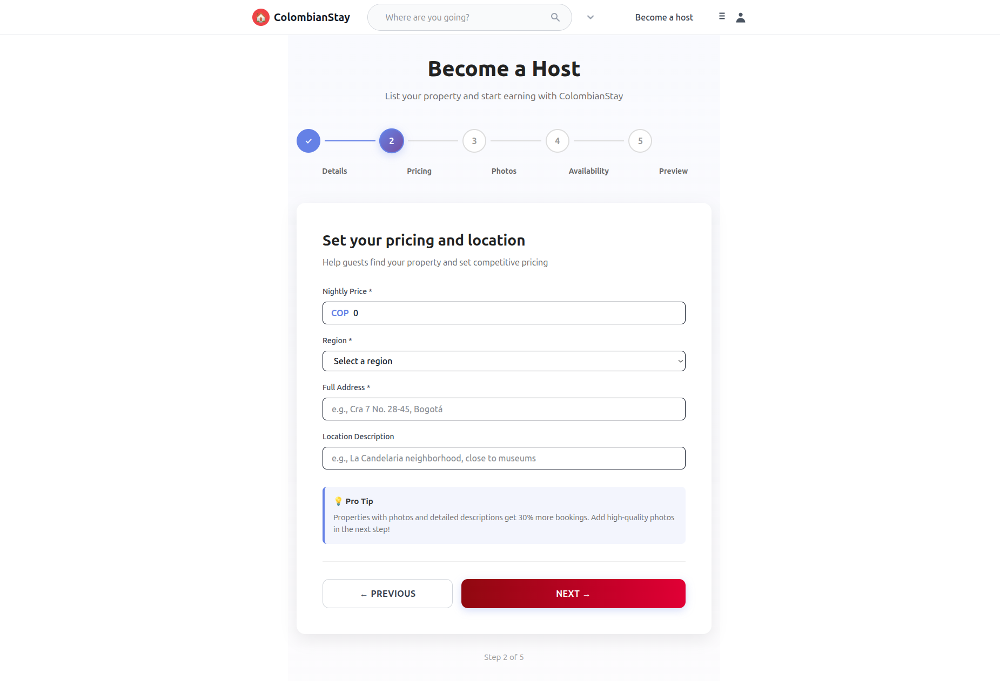
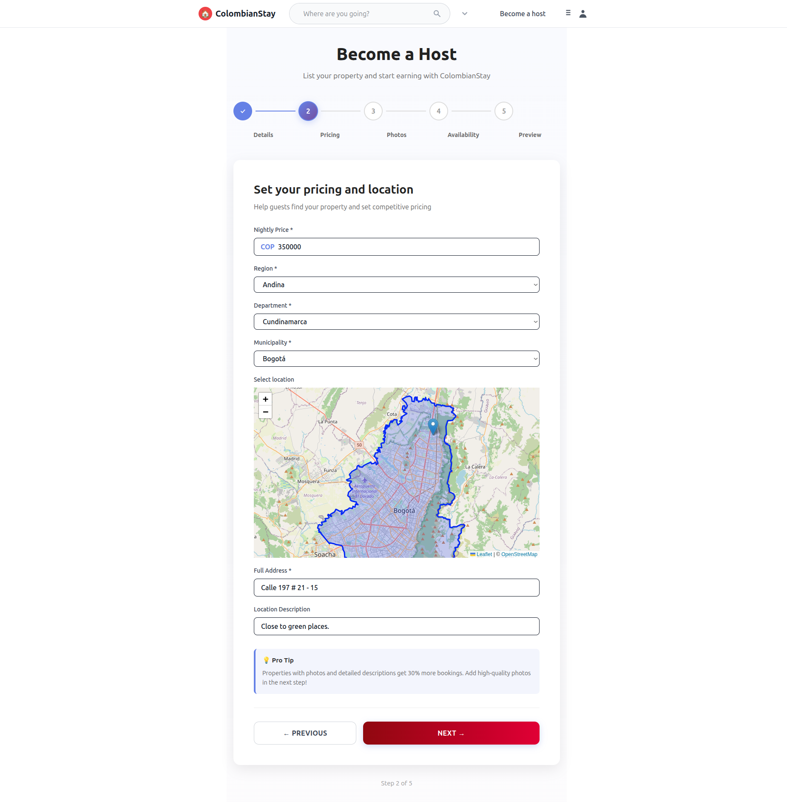
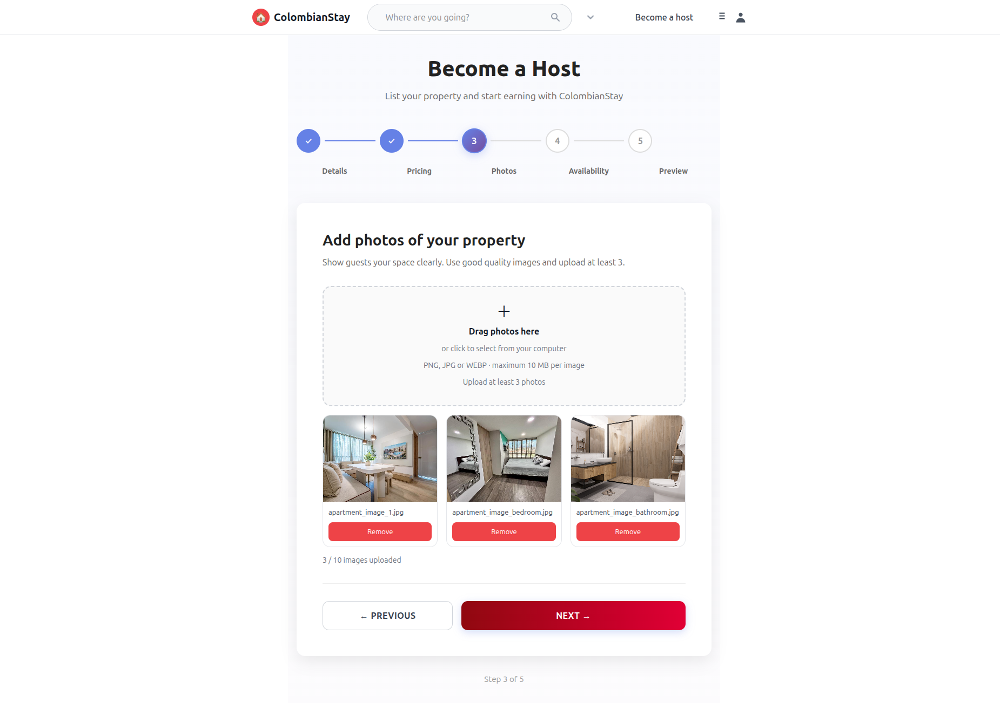
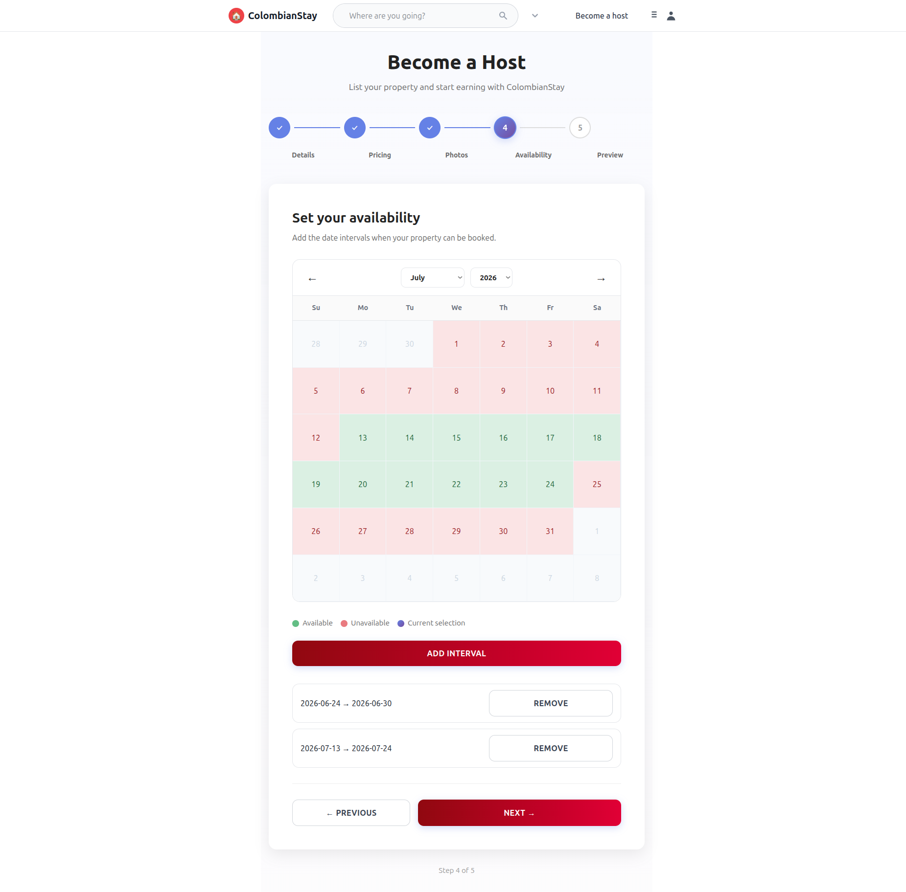
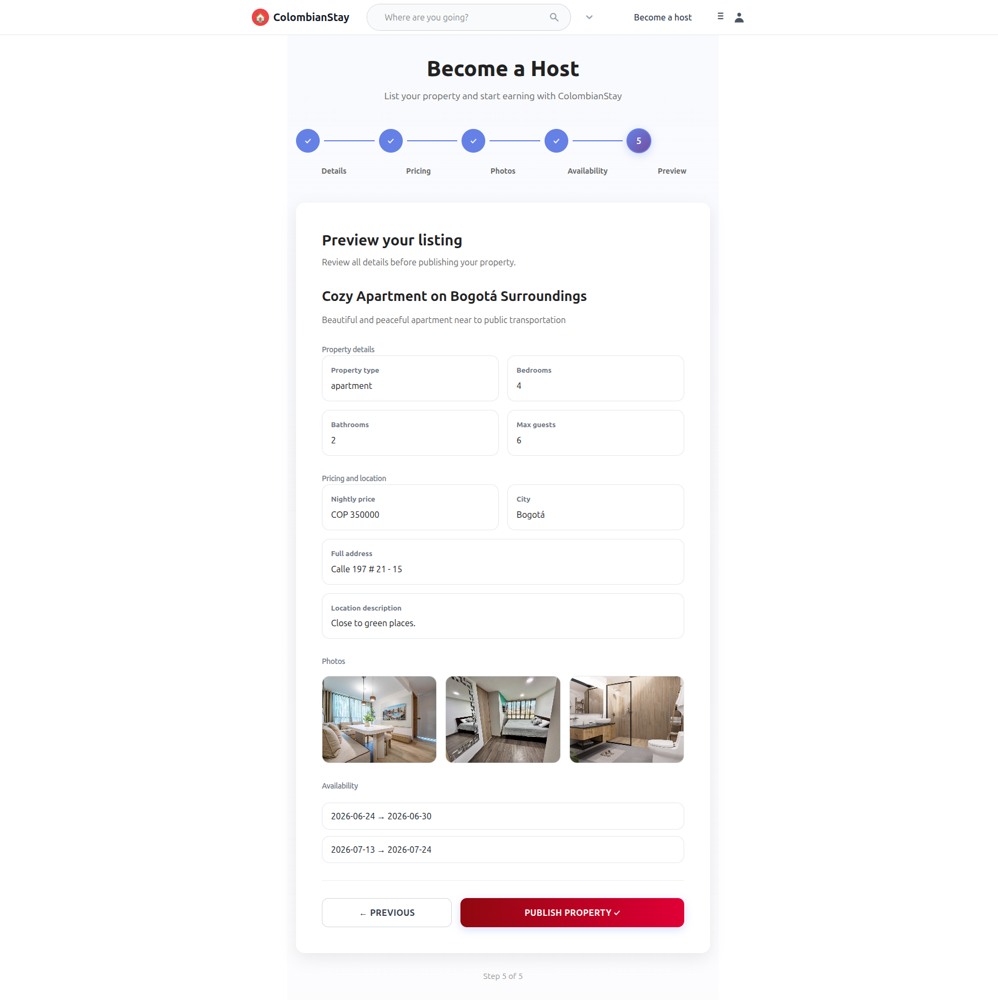
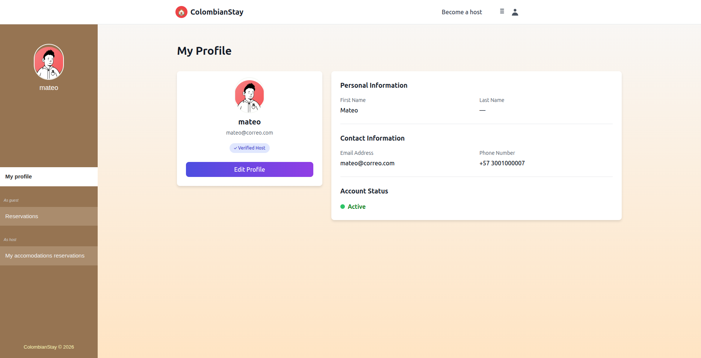
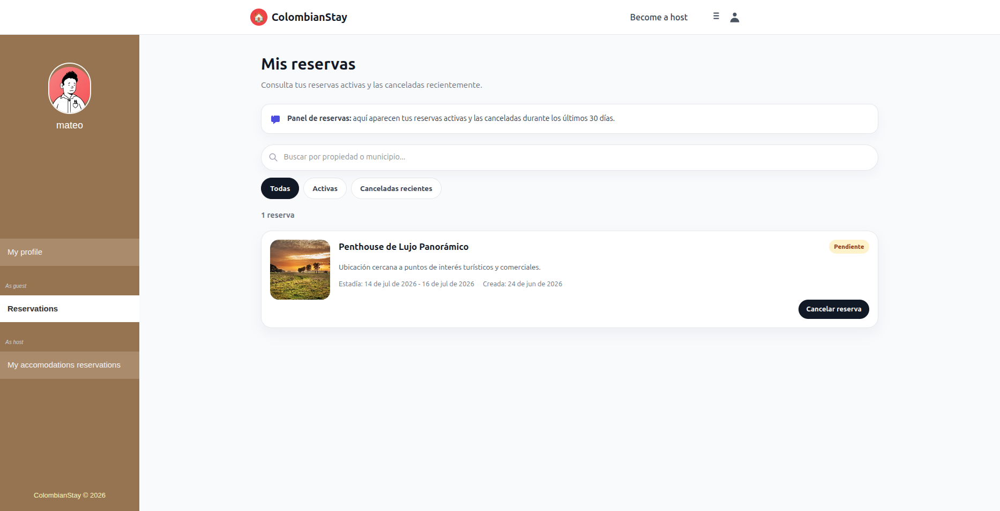
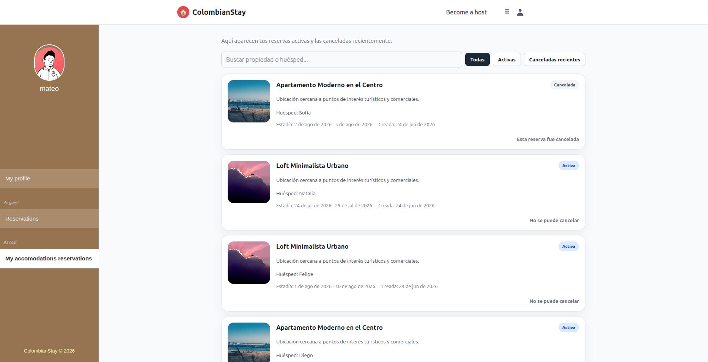

# 🏡 ColombianStay


### Service-Oriented Accommodation Platform with Geospatial Features

ColombianStay is a full-stack accommodation management platform that enables users to publish, discover, book, and review properties through an intuitive and interactive experience.

The system is built using a service-oriented architecture that separates key business domains such as user management, listings, bookings, reviews, and geographic information. By combining modern web technologies with geospatial capabilities, ColombianStay provides an efficient way to manage accommodations while offering map-based property visualization and location-aware functionalities.

The project showcases full-stack software engineering practices, including REST API development, secure authentication, geospatial data processing, automated testing, and scalable application design.

---

## 🚀 Features

### User Management

- User registration and authentication.
- JWT-based authentication with access and refresh tokens.
- Profile management and updates.
- Role-based access control.

### Property Listings

- Create, update, and manage accommodation listings.
- Property information management.
- Image support.
- Geographic location assignment.

### Booking System

- Reservation creation and management.
- Booking status tracking.
- Booking validation rules.
- Guest and host interactions.

### Reviews & Ratings

- Rating system linked to completed bookings.
- Review eligibility validation.
- User feedback management.

### Geospatial Features

- Interactive property visualization using maps.
- Geographic coordinate management.
- Municipality boundary visualization.
- GeoJSON integration.
- MultiPolygon support through PostGIS.

### Software Quality

- Automated testing for critical functionalities.
- Validation of business rules.
- API endpoint testing.
- Model and serializer testing.

---

# 📸 Screenshots

> Add screenshots or GIFs here to showcase the application.

### Home Page


### Property Details



### Property Creation

Step 1:



Step 2:





Step 3:



Step 4:



Step 5:



### My Profile



### My Own Reservations



### My Host Reservations



---

# 🏗️ System Architecture

ColombianStay follows a service-oriented architecture that separates business responsibilities into independent modules while maintaining a unified API layer.

```text
            Frontend (React)
                  │
                  ▼
  REST API Layer (Django REST Framework)
                  │
       ┌──────────┼──────────┬──────────┐
       ▼          ▼          ▼          ▼
      Users    Listings   Bookings    Rating  
      Service   Service   Service     Service
                  │
                  ▼
         PostgreSQL + PostGIS
```

### Communication Flow

1. Users interact with the React frontend.
2. Frontend components communicate with backend services through REST APIs.
3. Django REST Framework handles authentication, business logic, and validation.
4. PostgreSQL stores relational data.
5. PostGIS manages geospatial information.
6. Frontend renders the information interactive maps and geographic data on the client side.

---

# 🛠️ Technology Stack

## Frontend

- React
- React Router
- Axios
- Leaflet
- JavaScript (ES6+)

## Backend

- Django
- Django REST Framework
- Simple JWT
- GeoDjango

## Database

- PostgreSQL
- PostGIS

## Testing

- Django Test Framework
- Automated API Testing
- Model Validation Testing
- e2e testing with cypress
- Eficcency testing with locust

## Development Tools

- Git
- GitHub
- Docker

---

# 🌍 Geospatial Capabilities

One of the main technical highlights of ColombianStay is its integration of Geographic Information Systems (GIS) technologies.

### Implemented Features

- Coordinate storage and validation.
- Interactive map visualization.
- Municipality boundary management.
- GeoJSON generation and consumption.
- MultiPolygon geometry support.
- Location-based property representation.

These capabilities enable a richer user experience while demonstrating practical usage of geospatial technologies in modern web applications.

---

# 📂 Project Structure by service

```text
colombianstay/
│
├── frontend/
│   ├── components/
│   ├── pages/
│   ├── services/
│   ├── hooks/
│   ├── routes/
│   └── layout/
│
├── backend/
│   ├── migrations/
│   ├── models.py
│   ├── serializers.py
│   ├── views.py
│   ├── urls.py
│   └── tests.py
│
└── database/
    └── PostgreSQL + PostGIS
```

---

# 🔐 Security

ColombianStay implements modern authentication and authorization mechanisms:

- JWT Authentication.
- Access Token and Refresh Token flow.
- Protected API endpoints.
- User ownership validation.
- Permission-based access control.
- Backend validation of business rules.

---

# 🧪 Testing Strategy

The project includes automated tests designed to validate critical business operations and ensure application reliability.

### Tested Components

- Authentication workflows.
- User management operations.
- Listing creation and updates.
- Booking business rules.
- Review eligibility restrictions.
- API endpoint responses.
- Serializer validations.
- Model constraints.

### Benefits

- Early bug detection.
- Reduced regression issues.
- Improved maintainability.
- Greater confidence during feature development.

---

# 📚 Key Learnings

This project provided practical experience in:

- Full-stack web development.
- Service-oriented architecture design.
- REST API development.
- Authentication and authorization mechanisms.
- Geographic Information Systems (GIS).
- Automated software testing.
- Database modeling and validation.
- Frontend and backend integration.

---

# 🚀 Future Improvements

Potential future enhancements include:

- Property availability calendar optimization.
- Advanced geospatial search filters.
- Notification system.
- Recommendation engine.
- Administrative analytics dashboard.

---

# 👨‍💻 Development Leader

**Julián Espinosa**

System Engineering Student focused on Full-Stack Development, Backend Architecture, and Software Quality.

---

## 📄 License

This project is intended for educational, portfolio, and professional showcase purposes.
